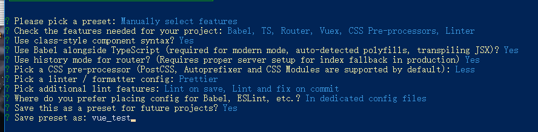

# vue环境配置

## vue项目生成

```bash
? Please pick a preset: Manually select features                                                             # 选择对应的配置
? Check the features needed for your project: Babel, TS, Router, Vuex, CSS Pre-processors, Linter            # 选择项目需要的依赖
? Use class-style component syntax? Yes                                                                      # 选择css语法
? Use Babel alongside TypeScript (required for modern mode, auto-detected polyfills, transpiling JSX)? Yes   # ts语法配置
? Use history mode for router? (Requires proper server setup for index fallback in production) Yes           # 使用历史路由
? Pick a CSS pre-processor (PostCSS, Autoprefixer and CSS Modules are supported by default): Less            # css的语法格式
? Pick a linter / formatter config: Prettier                                                                 # 选择代码检查
? Pick additional lint features: Lint on save, Lint and fix on commit                                        # 选择代码检查的时间
? Where do you prefer placing config for Babel, ESLint, etc.? In dedicated config files                      # 是否单独生成配置文件
? Save this as a preset for future projects? Yes                                                             # 是否选择保留本次配置
? Save preset as: vue_project
```



## eslint配置

```json
module.exports = {
  root: true,
  env: {
    node: true
  },
  'extends': [
    'plugin:vue/essential',
    'eslint:recommended',
    '@vue/typescript/recommended'
  ],
  parserOptions: {
    ecmaVersion: 2020
  },
  rules: {
    "no-mixed-spaces-and-tabs": [0],
    "no-trailing-spaces": 1,
    "no-tabs": [2, { allowIndentationTabs: true }],
    "comma-dangle": [2, "never"],                                              // 末尾总是不存在逗号
    "comma-spacing": [2, { "before": false, "after": true }],                  // 逗号之后存在空格
    "no-eq-null": 2,                                                           // 禁止对null使用==或!=运算符
    "arrow-spacing": 2,                                                        // =>的前/后括号
    "no-multi-spaces": "error",                                                // 禁止使用多个空格
    'indent': ['warn', 2],                                                     // 强制使用2个空格缩减
    'linebreak-style': [0, "windows"],
    'quotes': [1, 'single'],                                                   // 使用单引号
    "switch-colon-spacing": ["error", {"after": true, "before": false}],       // 冒号后空格
    "space-unary-ops": ["error", {"words": true, "nonwords": true}],           // 一元运算符号带空格
    'semi': [1,'never'],
    'vue/no-parsing-error': [1, { 'x-invalid-end-tag': false }],
    "no-unused-vars": 'off',
    "no-console": "warn"                                                       // console打印提示
  }
}

```
